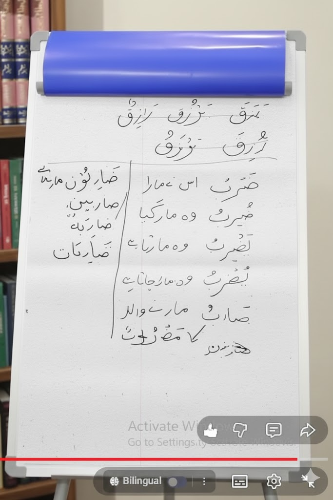

Certainly! Here are the updated notes with the **Arabic script** for every example and pattern. I have also added more examples to ensure you have a solid grasp of each structure.

# 📝 Lecture Notes: Quran Tafseer & Arabic Grammar (Class #2)

**Instructor:** Mufti Tariq Masood
**Topic:** Present/Future Tense & Active/Passive Participles

---

## ⏳ 1. Present & Future Tense (Muzara - مُضَارِع)

The **Muzara** pattern covers both "He does" and "He will do."

### **The Pattern: Ya-F'a-Lu (يَفْعَلُ)**

| Meaning | Past (He did) | Present (He does/will do) | Arabic Script |
| --- | --- | --- | --- |
| **To Hit** | Zaraba | **Yazribu** | ضَرَبَ ← **يَضْرِبُ** |
| **To Help** | Nasara | **Yansuru** | نَصَرَ ← **يَنْصُرُ** |
| **To Hear** | Sami'a | **Yasma'u** | سَمِعَ ← **يَسْمَعُ** |
| **To Open** | Fataha | **Yaftahu** | فَتَحَ ← **يَفْتَحُ** |
| **To Enter** | Dakhala | **Yadkhulu** | دَخَلَ ← **يَدْخُلُ** |
| **To Create** | Khalaqa | **Yakhluqu** | خَلَقَ ← **يَخْلُقُ** |
| **To Know** | 'Alima | **Ya'lamu** | عَلِمَ ← **يَعْلَمُ** |
| **To Write** | Kataba | **Yaktubu** | كَتَبَ ← **يَكْتُبُ** |
| **To Worship** | 'Abada | **Ya'budu** | عَبَدَ ← **يَعْبُدُ** |
| **To Return** | Raja'a | **Yarji'u** | رَجَعَ ← **يَرْجِعُ** |
| **To Lift/Raise** | Rafa'a | **Yarfa'u** | رَفَعَ ← **يَرْفَعُ** |

---

## 👤 2. The Doer (Ism-e-Fa'il - اِسْمُ الْفَاعِل)

This pattern identifies the person performing the action.

* **Pattern:** **Fa-'il** (**فَاعِل**)

| Action | Doer (Active Participle) | Arabic Script |
| --- | --- | --- |
| **Killing** | Qatil (Killer) | **قَاتِل** |
| **Helping** | Nasir (Helper) | **نَاصِر** |
| **Sajdah** | Sajid (Prostrator) | **سَاجِد** |
| **Oppressing** | Zalim (Oppressor) | **ظَالِم** |
| **Knowing** | 'Alim (Scholar) | **عَالِم** |
| **Truth** | Sadiq (Truthful) | **صَادِق** |
| **Kufr** | Kafir (Disbeliever) | **كَافِر** |
| **Patience** | Sabir (Patient) | **صَابِر** |
| **Gratitude** | Shakir (Grateful) | **شَاكِر** |
| **Creation** | Khaliq (Creator) | **خَالِق** |
| **Witnessing** | Shahid (Witness) | **شَاهِد** |
| **Remembering** | Dhakir (Rememberer) | **ذَاكِر** |

---

## 🎯 3. The Object (Ism-e-Maf'ool - اِسْمُ الْمَفْعُول)

This describes the person or thing receiving the action.

* **Pattern:** **Maf-'ool** (**مَفْعُول**)

| Action | Object (Passive Participle) | Arabic Script | Meaning |
| --- | --- | --- | --- |
| **Killing** | **Maqtool** | **مَقْتُول** | The one killed |
| **Oppression** | **Mazloom** | **مَظْلُوم** | The one oppressed |
| **Worship** | **Ma'bood** | **مَعْبُود** | The one worshipped |
| **Creation** | **Makhlooq** | **مَخْلُوق** | The creation |
| **Knowledge** | **Ma'loom** | **مَعْلُوم** | The known/Information |
| **Opening** | **Maftooh** | **مَفْتُوح** | The opened/conquered |
| **Provision** | **Marzook** | **مَرْزُوق** | Provided for |
| **Praise** | **Mahmood** | **مَحْمُود** | The praised one |
| **Writing** | **Maktoob** | **مَكْتُوب** | The written (letter) |
| **Prohibition** | **Mamnoo'** | **مَمْنُوع** | The forbidden |
| **Broken** | **Maksoor** | **مَكْسُور** | The broken |

---

## 🔄 4. Passive Voice Present (Muzara Majhool - مُضَارِع مَجْهُول)

Describes an action being done to someone in the present/future.

* **Pattern:** **Yuf-'a-lu** (**يُفْعَلُ**)

| Active (He does) | Passive (He is being...) | Arabic Script |
| --- | --- | --- |
| Yazribu (He hits) | **Yuzrabu** | يَضْرِبُ ← **يُضْرَبُ** |
| Yansuru (He helps) | **Yunsaru** | يَنْصُرُ ← **يُنْصَرُ** |
| Yakhluqu (He creates) | **Yukhlaqu** | يَخْلُقُ ← **يُخْلَقُ** |
| Yarzuqu (He provides) | **Yurzaqu** | يَرْزُقُ ← **يُرْزَقُ** |
| Yaktubu (He writes) | **Yuktabu** | يَكْتُبُ ← **يُكْتَبُ** |
| Yaftahu (He opens) | **Yuftahu** | يَفْتَحُ ← **يُفْتَحُ** |
| Ya'rifu (He knows) | **Yu'rafu** | يَعْرِفُ ← **يُعْرَفُ** |
| Yadhkuru (He mentions) | **Yudhkaru** | يَذْكُرُ ← **يُذْكَرُ** |

---

### **Master Summary Table**

| Concept | Pattern | Example | Arabic Text |
| --- | --- | --- | --- |
| **Past Tense** | Fa-'a-la | Nasara | **نَصَرَ** |
| **Present Tense** | Ya-f'u-lu | Yansuru | **يَنْصُرُ** |
| **The Doer** | Fa-'il | Nasir | **نَاصِر** |
| **The Object** | Maf-'ool | Mansoor | **مَنْصُور** |
| **Passive Present** | Yuf-'a-lu | Yunsaru | **يُنْصَرُ** |

