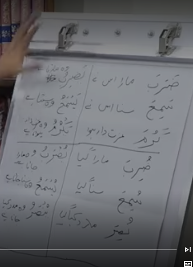
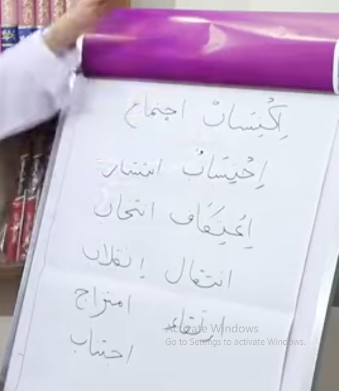
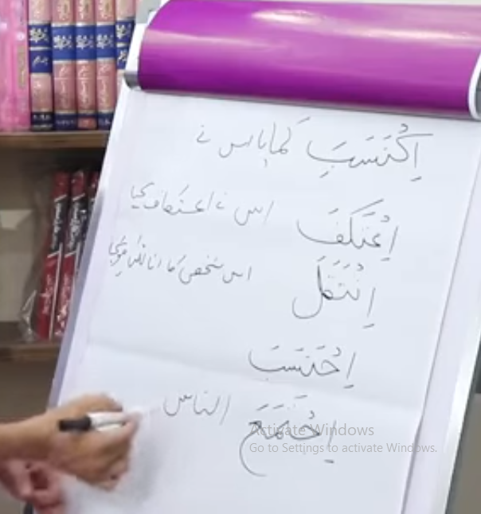

# 📝 Lecture Notes: Quran Tafseer & Arabic Grammar (Class #3)
**Instructor:** Mufti Tariq Masood
**Topic:** Complex Verb Patterns - *Iftiaal* (اِفْتِعَال)

---

## 📌 1. Review of Previous Classes
Before starting the new topic, a quick recap of the fundamental patterns:

### **Past Tense (Maazi - مَاضِي)**
* **Active:** *Fa-'a-la* (فَعَلَ) e.g., *Zaraba* (He hit), *Sami'a* (He heard).
* **Passive:** *Fu-'i-la* (فُعِلَ) e.g., *Zuriba* (He was hit).

### **Present/Future Tense (Muzara - مُضَارِع)**
* **Active:** *Ya-f'a-lu* (يَفْعَلُ) e.g., *Yazribu* (He hits/will hit).
* **Passive:** *Yu-f'a-lu* (يُفْعَلُ) e.g., *Yuzrabu* (He is/will be hit).

### **Active & Passive Participles**
* **Ism-e-Fa'il (Doer):** *Fa-'il* (فَاعِل) e.g., *Zarib* (Hitter).
* **Ism-e-Maf'ool (Object):** *Maf-'ool* (مَفْعُول) e.g., *Mazroob* (The one hit).

---

## 📖 2. Verbs with Fixed Patterns (*Masdar*)
Some Arabic roots follow complex, fixed patterns called *Abwaab*. Today's focus is on **Iftiaal (اِفْتِعَال)**. Many Urdu words use this shape.

### **Expanded List of Masdar Examples:**
* **Iktisaab** (To Earn / Acquisition)
* **Intizaam** (Arrangement / Management)
* **Intixaab** (Election / Selection)
* **I'tikaaf** (Seclusion)
* **Intiqaal** (Transfer / Passing away)
* **Ijtimaa'** (Gathering)
* **Intishaar** (Chaos / Spread)
* **I'tiraaf** (Confession / Recognition)
* **Ihtiraam** (Respect)
* **Ikhtilaaf** (Difference / Disagreement)
* **Ijtinaab** (Avoidance)

---

## ⏳ 3. Conjugating the *Iftiaal* Pattern

### **Example: Iktisaab (To Earn)**

| Tense/Form | Pattern (Arabic) | Example | Meaning |
| :--- | :--- | :--- | :--- |
| **Past Active** | *Ift-a-'a-la* | **Iktasaba** | He earned |
| **Past Passive** | *Uft-u-'i-la* | **Uktusiba** | He/It was earned |
| **Present Active** | *Yat-ta-'i-lu* | **Yaktasibu** | He earns / will earn |
| **Present Passive** | *Yut-ta-'a-lu* | **Yuktasabu** | It is / will be earned |
| **Doer (Fa'il)** | *Muft-a-'il* | **Muktasib** | Earner |
| **Object (Maf'ool)**| *Muft-a-'al* | **Muktasab** | Earned thing |

---

## 👤 4. Ism-e-Fa'il vs. Ism-e-Maf'ool (The Doer vs. The Object)
The difference is the vowel on the second-to-last letter:
* **Zer (Kasra)** = The Doer.
* **Zabar (Fatha)** = The Object.

### **More Practical Examples:**

| Doer (Ism-e-Fa'il) | Meaning | Object (Ism-e-Maf'ool) | Meaning |
| :--- | :--- | :--- | :--- |
| **Muhtasib** | Accountant | **Muhtasab** | Accounted for |
| **Mumtahin** | Examiner | **Mumtahan** | Examinee |
| **Muhtamim** | Manager | **Muhtamam** | Managed |
| **Muntazim** | Organizer | **Muntazam** | Organized |
| **Muntazir** | Waiter/Expectant | **Muntazar** | Awaited thing |
| **Muntaxib** | Selector/Voter | **Muntaxab** | Selected/Elected |
| **Mu'tarif** | Confessor | **Mu'taraf** | Recognized fact |
| **Muhtaram** | (Commonly used as Object) | **Muhtaram** | Respected one |
| **Mu'tadil** | Balanced person | **-** | - |
| **Mujtahid** | Hard worker/Striver | **-** | - |
| **Muqtarib** | One who is near | **-** | - |

---

## 💡 5. Plurals and Feminine Forms
* **Masculine Plural:** *Muktasiboona* (Earners), *Muntaxabeena* (Elected ones).
* **Feminine Singular:** *Muktasibatun* (Female earner).
* **Feminine Plural:** *Muktasibaat* (Female earners).

---

## 🏁 Summary
1. Pay attention to the **Second-to-last letter**: **Zer** means "the person doing it," and **Zabar** means "the thing it happened to."
2. Recognize words like **Intiqaal** or **Ijtimaa'** in the Quran to immediately understand their root meaning using your Urdu knowledge.

# 📝 Extended Lecture Notes: Quran Tafseer & Arabic Grammar (Class #3)
**Instructor:** Mufti Tariq Masood
**Topic:** Complex Verb Patterns - *Iftiaal* (اِفْتِعَال)

---

## 📌 1. Pattern Overview: Iftiaal (اِفْتِعَال)
This "Bab" (pattern) usually adds an **Alif** at the start and a **Ta (ت)** after the first root letter. It is used to convey "effort," "acquisition," or "doing something for oneself."

### **The "Master Key" Pattern**
| Tense | Arabic Formula | Sample Word (Arabic Script) | Translation |
| :--- | :--- | :--- | :--- |
| **Past Active** | *Ifta'ala* | **Iktasaba** (اِكْتَسَبَ) | He earned |
| **Past Passive** | *Uftu'ila* | **Uktusiba** (اُكْتُسِبَ) | It was earned |
| **Present Active** | *Yafta'ilu* | **Yaktasibu** (يَكْتَسِبُ) | He earns |
| **Present Passive**| *Yufta'alu* | **Yuktasabu** (يُكْتَسَبُ) | It is being earned |
| **Doer (Subject)** | *Mufta'il* | **Muktasib** (مُكْتَسِب) | The earner |
| **Object (Maf'ool)**| *Mufta'al* | **Muktasab** (مُكْتَسَب) | The earned thing |

---

## 📖 2. Practice Set A: Common Religious & Quranic Terms
These words appear frequently in the Quran. Notice how the meaning stays the same while the "shape" changes.

| Root Meaning | Past (He...) | Present (He...) | Doer (The...) | Object (Thing...) |
| :--- | :--- | :--- | :--- | :--- |
| **To Seclude** | I'takafa | Ya'takifu | **Mu'takif** | - |
| **To Follow** | Ittaba'a | Yattabi'u | **Muttabi'** | **Muttaba'** |
| **To Be Near** | Iqtaraba | Yaqtaribu | **Muqtarib** | - |
| **To Believe** | I'taqada | Ya'taqidu | **Mu'taqid** | **Mu'taqad** |
| **To Abstain** | Ijtanaba | Yajtanibu | **Mujtanib** | **Mujtanab** |
| **To Strive** | Ijtahada | Yajtahidu | **Mujtahid** | - |
| **To Invent** | Ibtada'a | Yabtadi'u | **Mubtadi'** | **Mubtada'** |
| **To Wait** | Intazara | Yantaziru | **Muntazir** | **Muntazar** |
| **To Confess** | I'tarafa | Ya'tarifu | **Mu'tarif** | **Mu'taraf** |

---

## 📖 3. Practice Set B: Common Urdu/Professional Terms
Use your knowledge of Urdu to master these Arabic structures.

| Root Meaning | Past (He...) | Present (He...) | Doer (The...) | Object (The...) |
| :--- | :--- | :--- | :--- | :--- |
| **Management** | Intazama | Yantazimu | **Muntazim** | **Muntazam** |
| **Election** | Intaxaba | Yantaxibu | **Muntaxib** | **Muntaxab** |
| **Examination** | Imtahana | Yamtahinu | **Mumtahin** | **Mumtahan** |
| **Respect** | Ihtarama | Yahtarimu | **Muhtarim** | **Muhtaram** |
| **Difference** | Ix-talafa | Yax-talifu | **Mux-talif** | - |
| **Transfer** | Intaqala | Yantaqilu | **Muntaqil** | **Muntaqal** |
| **Gathering** | Ijtama'a | Yaj-tami'u | **Mujtami'** | **Mujtama'** |
| **Spread** | Intashara | Yantashiru | **Muntashir** | - |
| **Accountability**| Ihtasaba | Yahtasibu | **Muhtasib** | **Muhtasab** |
| **Moderation** | I'tadala | Ya'tadilu | **Mu'tadil** | - |

---

## 📖 4. Practice Set C: Vocabulary Booster
Further examples to solidify the pattern recognition.

| Meaning | Past | Present | Doer (Fa'il) | Object (Maf'ool) |
| :--- | :--- | :--- | :--- | :--- |
| **To Burn** | Ihtaraqa | Yahtariqu | **Muhtariq** | - |
| **To Gather** | Ihtashara | Yahtashiru | **Muhtashir** | **Muhtashar** |
| **To Listen** | Istama'a | Yastami'u | **Mustami'** | **Mustama'** |
| **To Purchase** | Ishtara | Yashtari | **Mushtari** | **Mushtara** |
| **To Busy self** | Ishtaghala | Yashtaghilu | **Mushtaghil**| **Mushtaghal**|
| **To Be famous** | Ishtahara | Yashtahiru | **Mushtahir** | **Mushtahar** |
| **To Connect** | Ittasala | Yattasilu | **Muttasil** | - |
| **To Agree** | Ittafaqa | Yattafiqu | **Muttafiq** | **Muttafaq** |
| **To Rely** | I'tamada | Ya'tamidu | **Mu'tamid** | **Mu'tamad** |
| **To Ornament** | Iz-tayana | Yaz-tayinu | **Muztayin** | **Muztayan** |

---

## 💡 5. Crucial Identification Tips
1. **The "M" Rule:** Almost all "Doers" (Ism-e-Fa'il) in these complex patterns start with a **Mu-** (e.g., **Mu**ntazim, **Mu**htasib).
2. **The Vowel Swap:**
    * **-i-** (Zer) on the second-to-last letter = **The Person** (Muhtasi**b** - Accountant).
    * **-a-** (Zabar) on the second-to-last letter = **The Process/Object** (Muhtasa**b** - The Accounted).
3. **Plurals:**
    * To make "Accountants" (plural): **Muhtasiboona** (Arabic) or **Muhtasibeen**.
    * To make "Elected Ones": **Muntaxaboona** or **Muntaxabeen**.

---

## 🏁 Summary Challenge
Look for these words in the Quran today:
* **Ittaqoo** (They were cautious/pious - from the root of Taqwa).
* **Ixtalafa** (They differed).
* **Yattabi'oon** (They follow).

Recognizing the **Iftiaal** shape allows you to unlock the meaning of hundreds of words instantly!

# 📝 Extended Lecture Notes: Quran Tafseer & Arabic Grammar (Class #3)
**Instructor:** Mufti Tariq Masood
**Topic:** Complex Verb Patterns - *Iftiaal* (اِفْتِعَال)

---

## 📌 1. Pattern Overview: Iftiaal (اِفْتِعَال)
This "Bab" (pattern) usually adds an **Alif** at the start and a **Ta (ت)** after the first root letter. It is often used to convey "effort," "acquisition," or "doing something for oneself."

### **The "Master Key" Pattern**

| Tense | Arabic Formula | Sample Word (Arabic) | Translation |
| :--- | :--- | :--- | :--- |
| **Past Active** | *Ifta'ala* | **Iktasaba** (اِكْتَسَبَ) | He earned |
| **Past Passive** | *Uftu'ila* | **Uktusiba** (اُكْتُسِبَ) | It was earned |
| **Present Active** | *Yafta'ilu* | **Yaktasibu** (يَكْتَسِبُ) | He earns |
| **Present Passive**| *Yufta'alu* | **Yuktasabu** (يُكْتَسَبُ) | It is being earned |
| **Doer (Subject)** | *Mufta'il* | **Muktasib** (مُكْتَسِب) | The earner |
| **Object (Maf'ool)**| *Mufta'al* | **Muktasab** (مُكْتَسَب) | The earned thing |

---

## 📖 2. Practice Set A: Religious & Quranic Terms
These words appear frequently in the Quran. Notice how the "shape" remains consistent across different roots.

| Root Meaning | Past (اِفْتَعَلَ) | Present (يَفْتَعِلُ) | Doer (مُفْتَعِل) | Object (مُفْتَعَل) |
| :--- | :--- | :--- | :--- | :--- |
| **To Follow** | **Ittaba'a** (اِتَّبَعَ) | **Yattabi'u** (يَتَّبِعُ) | **Muttabi'** (مُتَّبِع) | **Muttaba'** (مُتَّبَع) |
| **To Believe** | **I'taqada** (اِعْتَقَدَ) | **Yai'taqidu** (يَعْتَقِدُ) | **Mu'taqid** (مُعْتَقِد) | **Mu'taqad** (مُعْتَقَد) |
| **To Near** | **Iqtaraba** (اِقْتَرَبَ) | **Yaqtaribu** (يَقْتَرِبُ) | **Muqtarib** (مُقْتَرِب) | - |
| **To Abstain** | **Ijtanaba** (اِجْتَنَبَ) | **Yajtanibu** (يَجْتَنِبُ) | **Mujtanib** (مُجْتَنِب) | **Mujtanab** (مُجْتَنَب) |
| **To Strive** | **Ijtahada** (اِجْتَهَدَ) | **Yajtahidu** (يَجْتَهِدُ) | **Mujtahid** (مُجْتَهِد) | - |
| **To Wait** | **Intazara** (اِنْتَظَرَ) | **Yantaziru** (يَنْتَظِرُ) | **Muntazir** (مُنْتَظِر) | **Muntazar** (مُنْتَظَر) |
| **To Confess** | **I'tarafa** (اِعْتَرَفَ) | **Ya'tarifu** (يَعْتَرِفُ) | **Mu'tarif** (مُعْتَرِف) | **Mu'taraf** (مُعْتَرَف) |
| **To Seclude** | **I'takafa** (اِعْتَكَفَ) | **Ya'takifu** (يَعْتَكِفُ) | **Mu'takif** (مُعْتَكِف) | - |

---

## 📖 3. Practice Set B: Common Urdu/Professional Terms
Use your knowledge of Urdu to master these Arabic structures.

| Root Meaning | Past (اِفْتَعَلَ) | Present (يَفْتَعِلُ) | Doer (مُفْتَعِل) | Object (مُفْتَعَل) |
| :--- | :--- | :--- | :--- | :--- |
| **Management** | **Intazama** (اِنْتَظَمَ) | **Yantazimu** (يَنْتَظِمُ) | **Muntazim** (مُنْتَظِم) | **Muntazam** (مُنْتَظَم) |
| **Election** | **Intaxaba** (اِنْتَخَبَ) | **Yantaxibu** (يَنْتَخِبُ) | **Muntaxib** (مُنْتَخِب) | **Muntaxab** (مُنْتَخَب) |
| **Examination** | **Imtahana** (اِمْتَحَنَ) | **Yamtahinu** (يَمْتَحِنُ) | **Mumtahin** (مُمْتَحِن) | **Mumtahan** (مُمْتَحَن) |
| **Respect** | **Ihtarama** (اِحْتَرَمَ) | **Yahtarimu** (يَحْتَرِمُ) | **Muhtarim** (مُحْتَرِم) | **Muhtaram** (مُحْتَرَم) |
| **Difference** | **Ixtalafa** (اِخْتَلَفَ) | **Yaxtalifu** (يَخْتَلِفُ) | **Muxtalif** (مُخْتَلِف) | - |
| **Transfer** | **Intaqala** (اِنْتَقَلَ) | **Yantaqilu** (يَنْتَقِلُ) | **Muntaqil** (مُنْتَقِل) | **Muntaqal** (مُنْتَقَل) |
| **Gathering** | **Ijtama'a** (اِجْتَمَعَ) | **Yajtami'u** (يَجْتَمِعُ) | **Mujtami'** (مُجْتَمِع) | **Mujtama'** (مُجْتَمَع) |
| **Spread** | **Intashara** (اِنْتَشَرَ) | **Yantashiru** (يَنْتَشِرُ) | **Muntashir** (مُنْتَشِر) | - |
| **Accountability**| **Ihtasaba** (اِحْتَسَبَ) | **Yahtasibu** (يَحْتَسِبُ) | **Muhtasib** (مُحْتَسِب) | **Muhtasab** (مُحْتَسَب) |
| **Moderation** | **I'tadala** (اِعْتَدَلَ) | **Ya'tadilu** (يَعْتَدِلُ) | **Mu'tadil** (مُعْتَدِل) | - |

---

## 📖 4. Practice Set C: Additional Vocabulary
| Meaning | Past | Present | Doer (Fa'il) | Object (Maf'ool) |
| :--- | :--- | :--- | :--- | :--- |
| **To Burn** | **Ihtaraqa** (اِحْتَرَقَ) | **Yahtariqu** (يَهْتَرِقُ) | **Muhtariq** (مُحْتَرِق) | - |
| **To Listen** | **Istama'a** (اِسْتَمَعَ) | **Yastami'u** (يَسْتَمِعُ) | **Mustami'** (مُسْتَمِع) | **Mustama'** (مُسْتَمَع) |
| **To Purchase** | **Ishtara** (اِشْتَرَى) | **Yashtari** (يَشْتَرِي) | **Mushtari** (مُشْتَرِي) | **Mushtara** (مُشْتَرَى) |
| **To Busy self** | **Ishtaghala** (اِشْتَغَلَ) | **Yashtaghilu** (يَشْتَغِلُ) | **Mushtaghil** (مُشْتَغِل)| **Mushtaghal** (مُشْتَغَل)|
| **To Connect** | **Ittasala** (اِتَّصَلَ) | **Yattasilu** (يَتَّصِلُ) | **Muttasil** (مُتَّصِل) | - |
| **To Agree** | **Ittafaqa** (اِتَّفَقَ) | **Yattafiqu** (يَتَّفِقُ) | **Muttafiq** (مُتَّفِق) | **Muttafaq** (مُتَّفَق) |
| **To Rely** | **I'tamada** (اِعْتَمَدَ) | **Ya'tamidu** (يَعْتَمِدُ) | **Mu'tamid** (مُعْتَمِد) | **Mu'tamad** (مُعْتَمَد) |

---

## 💡 5. Crucial Identification Tips
1. **The "Mu-" (مُ) Rule:** In these complex patterns, the Doer and the Object *always* start with a **Mu-** sound.
2. **The Vowel Swap:**
    * **Zer ( ِ )** on the 2nd-to-last letter = **Active** (The person doing). 
    * *Example:* **Muntaxib** (مُنْتَخِب) - The one electing/voter.
    * **Zabar ( َ )** on the 2nd-to-last letter = **Passive** (The thing being done).
    * *Example:* **Muntaxab** (مُنْتَخَب) - The elected representative.
3. **Plurals:**
    * **-oona** (ـُون) or **-eena** (ـِين) for people.
    * *Example:* **Muxtalifoona** (مُخْتَلِفُون) - Differing ones.

---

## 🏁 Summary Challenge
Look for these patterns in the Quran today:
* **Ittaqoo** (اِتَّقُوا) - From the root of Taqwa (He was cautious).
* **Ixtalaf-tum** (اِخْتَلَفْتُمْ) - You all differed.
* **Yattabi'oon** (يَتَّبِعُونَ) - They follow.

Knowing the **Iftiaal** shape allows you to recognize and translate hundreds of Quranic and Urdu-related words instantly!