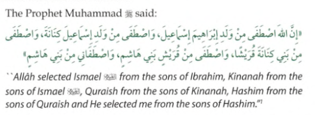
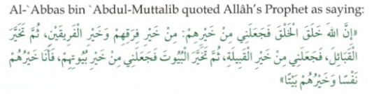
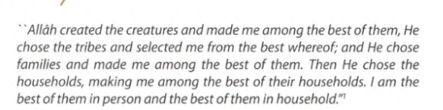

# 📝 Lecture Notes: Huzur SAWS Ka Nasab, Quraish or Arab Ka Taruf
**Course:** Seerat Course (Class 02)  
**Instructor:** Mufti Rasheed Official

---

## 📌 1. Recap & Practical Philosophy
* **The "Standard" of Seerat:** Seerat provides a "standard" (*Ma'yar*) for Islam. Without it, individuals often create their own version of religion based on personal temperament, culture, or background.
* **Temperament vs. Deen:** Some equate "strictness" with Deen, while others equate "softness" with it. True Deen is what the Prophet (SAWS) practiced, regardless of our innate nature.
* **Culture vs. Deen:** Many confuse cultural norms with Islamic teachings. Studying Seerat helps distinguish between local customs and universal Prophetic truths.

---

## 🌳 2. The Lineage (Nasab) of the Prophet (SAWS)
The Prophet (SAWS) belonged to the most noble family in Arabia and the entire world.

### **Paternal Lineage (Up to 21 Generations):**
Muhammad ibn Abdullah ibn Abdul Muttalib ibn **Hashim** ibn Abd Manaf ibn **Qusay** ibn Kilab ibn Murrah ibn Ka'b ibn Lu'ayy ibn Ghalib ibn **Fihr** ibn Malik ibn An-Nadr ibn Kinanah ibn Khuzaymah ibn Mudrikah ibn Ilyas ibn Mudar ibn Nizar ibn Ma'ad ibn **Adnan**.

### **Maternal Lineage:**
Aminah bint Wahb ibn Abd Manaf ibn Zuhrah ibn **Kilab**.
* **Intersection:** The paternal and maternal lineages meet at **Kilab** (the 5th generation back).

### **Key Titles explained:**
* **Adnani:** Referring to his ancestor **Adnan** (21st generation), connecting him to the lineage of Isma'il (AS).
* **Hashimi:** Referring to his great-grandfather **Hashim**.
* **Quraishi:** Referring to his tribe, the Quraish.

---

## 🐫 3. Introduction to the Arabs
Historians categorize Arabs into three groups:
1.  **Arab Ba'idah (Perished Arabs):** Ancient tribes like 'Ad and Thamud who were destroyed.
2.  **Arab 'Aribah (Pure Arabs):** Descendants of **Qahtan**. They are the original Arabic speakers.
3.  **Arab Musta'ribah (Arabized Arabs):** Descendants of **Isma'il (AS)**. They settled in Arabia and adopted the language. The Prophet (SAWS) belongs to this group.

---

حَدَّثَنِي عُبَيْدُ بْنُ إِسْمَاعِيلَ، عَنْ أَبِي أُسَامَةَ، عَنْ عُبَيْدِ اللَّهِ، قَالَ أَخْبَرَنِي سَعِيدُ بْنُ أَبِي سَعِيدٍ، عَنْ أَبِي هُرَيْرَةَ ـ رضى الله عنه ـ سُئِلَ رَسُولُ اللَّهِ صلى الله عليه وسلم مَنْ أَكْرَمُ النَّاسِ قَالَ ‏"‏ أَتْقَاهُمْ لِلَّهِ ‏"‏‏.‏ قَالُوا لَيْسَ عَنْ هَذَا نَسْأَلُكَ‏.‏ قَالَ ‏"‏ فَأَكْرَمُ النَّاسِ يُوسُفُ نَبِيُّ اللَّهِ ابْنُ نَبِيِّ اللَّهِ ابْنِ نَبِيِّ اللَّهِ ابْنِ خَلِيلِ اللَّهِ ‏"‏‏.‏ قَالُوا لَيْسَ عَنْ هَذَا نَسْأَلُكَ‏.‏ قَالَ ‏"‏ فَعَنْ مَعَادِنِ الْعَرَبِ تَسْأَلُونِي، النَّاسُ مَعَادِنُ خِيَارُهُمْ فِي الْجَاهِلِيَّةِ خِيَارُهُمْ فِي الإِسْلاَمِ إِذَا فَقِهُوا ‏"‏‏.‏ حَدَّثَنِي مُحَمَّدُ بْنُ سَلَامٍ أَخْبَرَنَا عَبْدَةُ عَنْ عُبَيْدِ اللَّهِ عَنْ سَعِيدٍ عَنْ أَبِي هُرَيْرَةَ رَضِيَ اللَّهُ عَنْهُ عَنْ النَّبِيِّ صَلَّى اللَّهُ عَلَيْهِ وَسَلَّمَ بِهَذَا

Narrated Abu Huraira: Allah's Messenger (ﷺ) was asked, "Who is the most honorable amongst the people?" He replied, "The most Allah fearing." The people said, "We do not want to ask you about this." He said, "The most honorable person is Joseph, Allah's Prophet, the son of Allah's Prophet, the son of Allah's Prophet, the son of Allah's Khalil" The people said, 'We do not want to ask you about this." He said," Then you want to ask me about the origins of the Arabs? People are of various origins. The best in the prelslamic period are the best in Islam, provided they comprehend (the religious knowledge).

Sahih al-Bukhari 3383
https://sunnah.com/bukhari:3383
## 🏛️ 4. The Tribe of Quraish
The Quraish was the most powerful and respected tribe due to their service to the **Ka'bah**.

### **Services to the Ka'bah:**
The Quraish held various honors, including:
* **Siqayah:** Providing water to pilgrims (held by Banu Hashim).
* **Rifadah:** Feeding the pilgrims (held by Banu Hashim).
* **Liwa:** Carrying the war banner (held by Banu Umayyah).
* **Nadwah:** Managing the parliament/assembly house.

---

## ✅ 5. The Nobility of Prophetic Lineage
* **Divine Selection:** Allah always chooses the most noble families for His Prophets. This prevents mockery of their status and ensures natural leadership.
* **Purity of Birth:** The Prophet (SAWS) stated that from Adam (AS) down to his parents, his entire lineage was established through **valid marriage (Nikah)**.

---

## ⚖️ 6. Does Lineage Benefit on Judgement Day?
Lineage is recognized by Shariah, but it has specific boundaries:
1.  **For Non-Believers:** Lineage provides **zero** benefit.
2.  **For Believers:** It can be a means of elevated rank. Allah may join children with their righteous parents in Jannah if the children were also believers *(Surah At-Tur, 21)*.
3.  **The Warning:** The Prophet (SAWS) warned his own family (Fatima RA and Safiyyah RA) to perform good deeds, as their relationship to him would not save them from Allah's justice if they lacked righteousness.

---

### **Summary Table: The Three Ancestral Ties**
| Title | Ancestor | Significance |
| :--- | :--- | :--- |
| **Adnani** | Adnan | Connects the Prophet (SAWS) to the lineage of Isma'il (AS). |
| **Quraishi** | Fihr / An-Nadr | Connects him to the ruling tribe of Makkah. |
| **Hashimi** | Hashim | Connects him to the family responsible for feeding pilgrims. |