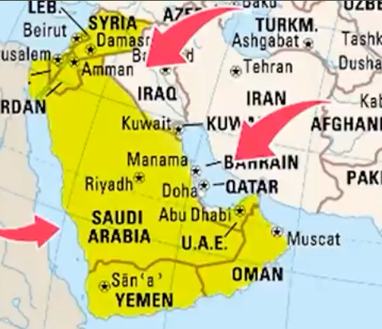
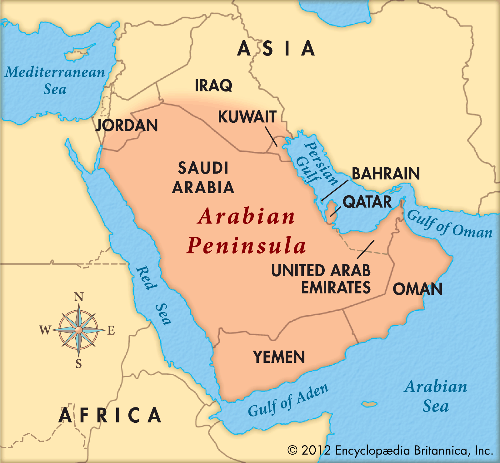
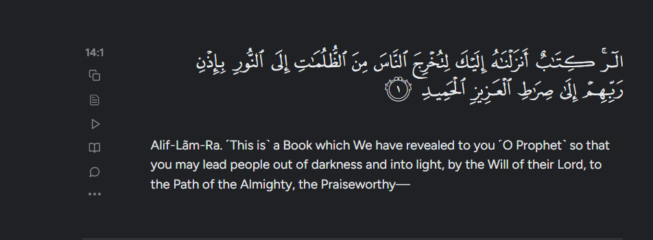

# 📝 Lecture Notes: The World at the Time of the Prophet's (SAWS) Birth
**Course:** Seerat Course (Class 03)  
**Instructor:** Mufti Rasheed Official  

---

## 📌 1. Introduction: History & Geography
* **The Goal:** To analyze the religious, social, and moral state of the 6th-century world to appreciate the scale of the Prophetic revolution.
* **The History-Geography Link:** History is incomplete without understanding the terrain.
    * **East (Mashriq):** Right side of the map.
    * **West (Maghrib):** Left side of the map.
    * **North (Shumal):** Top of the map.
    * **South (Junoob):** Bottom of the map.
* **Regional Context:** From Pakistan, Saudi Arabia lies to the **West**, which is why the Qibla (direction of prayer) is toward the West in the Indian subcontinent.

> **Summary:** Understanding geography is essential to visualize the spread of Islam and the strategic location of the Prophet's birth.

---

## 🗺️ 2. The Arabian Peninsula (Jaziratul Arab)
* **Terminology:** * *Jazirah:* An island (water on four sides).
    * *Jazirah-Numa:* A peninsula (water on three sides). Arabia is technically a peninsula.
* **Modern Political Geography:** The region is now divided into roughly 12 nations, including Saudi Arabia, Yemen, Oman, UAE, Qatar, Bahrain, Kuwait, Jordan, and others.

### **Physical Borders**
| Direction | Border Body |
| :--- | :--- |
| **East** | Persian Gulf (Khalij-e-Fars) |
| **West** | Red Sea (Bahira-e-Ahmar) – where Pharaoh was drowned |
| **South** | Arabian Sea / Indian Ocean |
| **North** | Landmass connecting to Syria, Jordan, and Turkey |

> **Summary:** Arabia acted as a natural bridge connecting the three known continents of the time: Asia, Africa, and Europe.

---

## 🏛️ 3. The Two Superpowers of the 6th Century

### **A. The Roman Empire (Byzantium)**
* **Territory:** Modern Europe, North Africa, Syria, and Palestine.
* **Religion:** Christianity (highly distorted by this era).
* **Internal State:**
    * Known as the **"Darkest Era of Humanity."**
    * Saint Paul’s influence led to the introduction of pagan rituals and the Trinity, moving away from original Monotheism.
    * *Rahbaniyat* (Monasticism) separated religion from practical life (politics/economics).
    * Extreme social oppression via heavy taxes to fund the luxury of the **Caesars**.

### **B. The Persian Empire (Sassanids)**
* **Territory:** Modern Iran, Iraq, and Central Asia.
* **Religion:** Zoroastrianism (Fire-worshippers/Majoosi).
* **Social Hierarchy:**
    * The **Chosroes** (Kings) claimed "Divine Blood."
    * A rigid caste system similar to ancient Hinduism.
    * Total moral collapse: Sects like the *Mazdakites* advocated for the communal ownership of women and property.

> **Summary:** Both superpowers were morally and spiritually bankrupt, creating a vacuum for a new global leadership.

---

## 🐪 4. The State of Pre-Islamic Arabia (Jahiliyyah)

### **Political & Psychological State**
* **Tribalism:** No central government; power rested with tribal chiefs.
* **Psychology:** Arabs were never colonized or enslaved, preserving a sense of fierce independence and a "fresh slate" for a new message.

### **Social & Moral Conditions**
* **Women:** Treated as property/assets. Female infanticide was a common practice driven by a false sense of shame.
* **Economics:** Dominated by *Riba* (usury/interest) and highway robbery.
* **Ethics:** Blind tribal loyalty—"Help your brother whether he is the oppressor or the oppressed."

### **Religious Landscape**
1.  **Idol Worshippers:** Used idols as intermediaries to reach Allah.
2.  **Dahriya (Atheists):** Believed only "Time" destroys life; no afterlife.
3.  **Jews & Christians:** Present in pockets like Madinah and Khaybar.
4.  **Hanifs:** A rare few following the original monotheism of Ibrahim (AS).

> **Summary:** Arabia was in "Total Darkness" (*Zulumat*), lacking a unified law or moral compass.

---

## 🕋 5. Why Arabia was Chosen?
1.  **Geographical Center:** Makkah was the heart of the known world, making the message easily accessible to all three continents.
2.  **Psychological Independence:** The lack of a central monarch meant the people were not mentally suppressed; they were brave and eloquent.
3.  **Linguistic Prowess:** The Arabic language had reached its peak of sophistication, capable of carrying the nuanced depth of the Final Revelation.
4.  **Spiritual Foundation:** The presence of the Ka'bah, built by Ibrahim (AS), provided a historical religious anchor.

> **Summary:** Arabia provided the perfect strategic, linguistic, and psychological environment to launch a global revolution.

---

## 🌟 6. The Selection of the Prophet's (SAWS) Personality
* **Refinement Through Hardship:** Being an orphan and working as a shepherd/trader removed any "royal arrogance," making him empathetic to all social classes.
* **Balance of Traits:** He combined the intelligence of the northern regions, the progressiveness of fertile lands (Madinah), and the hardiness of the desert (Makkah).
* **Practicality:** He was a living example. He didn't just teach values; he performed them (e.g., forgiving enemies at his moment of greatest power).

---

## 🏁 Final Point Summary
The Prophet (SAWS) brought a **comprehensive revolution**—spiritual, political, and social. The lecture concludes that the state of moral confusion in the pre-Islamic world mirrors the modern era, suggesting that the Prophetic system remains the only solution for humanity today.