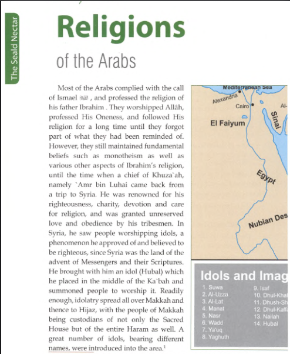
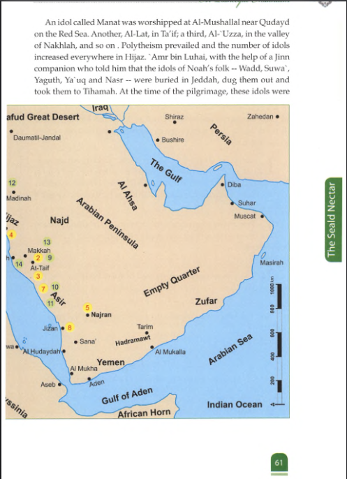

# Religions of Arabs 
  

Most of the early Arabs followed the religion of Prophet Ibrahim through Ismail and worshipped Allah alone, but over time they forgot much of this guidance and fell into idolatry after a leader named ‘Amr bin Luhai introduced idols from Syria into Makkah.[1]

## Religious condition of early Arabs
- Most Arabs initially followed the call of Ismail and the religion of his father Ibrahim.[1]
- They believed in Allah’s Oneness, worshipped Him alone, and followed this religion for a long time.[1]

## Gradual decline in true belief
- With the passage of time they forgot much of what they had been reminded of, though some fundamental beliefs like monotheism remained in traces.[1]
- Elements of Ibrahim’s religion survived alongside new practices and ideas.[1]

## Role of ‘Amr bin Luhai
- ‘Amr bin Luhai, a chief of Khuza‘ah, returned from a trip to Syria and was admired for his righteousness, charity, devotion and care for religion, so his people trusted him greatly.[1]
- In Syria he saw people worshipping idols, considered them righteous, and accepted this practice as something good.[1]

## Introduction of idols in Makkah
- ‘Amr bin Luhai brought an idol named Hubal from Syria and placed it inside the Ka‘bah.[1]
- He called people to worship it, and idolatry spread throughout Makkah and then to Hijaz, until Makkah became a center of idol worship for the whole region.[1]

## Extent of idolatry
- The custodians of the Ka‘bah and the Sacred House adopted idol worship, and the entire Haram area became full of idols.[1]
- Many idols of different tribes were introduced in and around the Ka‘bah, replacing pure monotheism with widespread polytheism.[1]

Based on the images you've shared and the current page view, here are comprehensive, copyable notes covering the religious practices and superstitions of pre-Islamic Arabs:

***

## Religions of the Arabs - Pre-Islamic Practices and Beliefs

### Superstitious practices with cattle dedicated to idols

**Types of cattle mentioned:**
- Sa'id bin Al-Musaiyib stated these cattle types were dedicated to false gods
- It has been authentically reported from the Prophet that such superstitions were first invented by 'Amr bin Luhai

**Arab belief about idol worship:**
- Arabs worshipped idols believing the idols would bring them nearer to Allah, lead them to Him, and mediate with Him for their sake
- Qur'an [39:3]: *"We worship them only that they may bring us near to Allah"*

**Qur'an [10:18]:** *"And they worship besides Allah things that hurt them not, nor profit them, and they say: 'These are our intercessors with Allah'"*

***

### Divinatory practices - Azlam (featherless arrows)

**Three types of Azlam arrows:**
1. One showing "yes"
2. Another showing "no"  
3. A third was blank

**Usage:**
- Used while deciding serious matters like travel, marriage, and important decisions
- If the draw showed "yes", they would proceed
- If "no", they would delay it for the next year

**Other types of Azlam:**
- Cast for water, blood money settlements
- Used to depict lineage: 'from you', 'not from you', or 'Mulsaq' (associated)
- In cases of doubt about a child's legitimacy, they would resort to the idol of Hubal with a hundred-camel gift for the arrow caster
- Only the arrows would decide the child's relationship to the father
- If the arrow showed 'from you', the child belonged to the tribe
- If it showed 'not from you', the person would be regarded as an ally
- If 'Mulsaq' appeared, the person would retain his position but with no lineage or alliance contract

**Connection to gambling and meat distribution:**
- This was very much like gambling and arrow-shafting whereby they used to divide the meat of camels they slaughtered according to this tradition

***

### Belief in soothsayers, diviners and astrologers

**Soothsayers (Kahin):**
- Someone who dealt in the business of foretelling future events
- Claimed knowledge of secrets
- Had subordinates who would communicate information to them

**Diviners:**
- Claimed they could uncover the unknown by means of a special power granted to them
- Boasted they could reveal hidden secrets by a cause-and-effect inductive process
- Would lead to detecting a stolen commodity, location of a theft, a stray animal, and the like

**Astrologers:**
- Belonged to a third category
- Observed the stars and calculated planetary positions
- Claimed to foretell the future
- Quraish believed their claims, though astrology was in reality a mixture of presumptions, whims, and devilish contacts

**Deep conviction:**
- Arabs had deep conviction in the tidings of soothsayers, diviners and astrologers

***

### Omens and superstitions about events

**Belief in portents:**
- Some days, months, and particular animals were regarded as portents
- Believed the soul of a murdered person would fly in the wilderness and would never be at rest until revenge was taken

**Superstitions about natural signs:**
- If a deer or bird, when released, turned right then the work they had embarked on would be regarded favorable
- Otherwise they would fear a negative outcome and refrain from pursuing it

**Attribution of rain to stars:**
- They would say: *"We were delivered rain because of the position of this star"*

***

### Retention of Abrahamic traditions despite innovations

**Mixed religious practices:**
- While believing in superstition, they still retained some Abrahamic traditions such as:
  - Devotion to Al-Ka'bah
  - Circumambulation
  - Observance of pilgrimage
  - Stay at 'Arafat
  - Offering sacrifices

**Alterations to sacred rituals:**
- All these rituals were observed despite some innovations that adulterated their sacredness
- As the Quraish were the descendants of Ibrahim, custodians of Al-Ka'bah and inhabitants of Makkah, no Arabs besides them had the same status or rights
- They referred to themselves as Al-Hums
- They would refrain from going to 'Arafat with the crowd
- Instead, they would stop short at Muzdalifah
- Qur'an [2:199]: *"Then depart from the place whence all the people depart"*

***

### Heresy regarding Ihram (sacred state of pilgrimage)

**Dietary restrictions in Ihram:**
- Deeply established in their social tradition
- Dictated that they would not eat dried yoghurt or cooking fat
- Would not enter a tent made of camel hair or seek shade unless in a house of adobe bricks, so long as they were in *Ihram* (the sacred state of pilgrimage)

**Misconception about pilgrims:**
- Out of a deeply-rooted misconception, they denied pilgrims (other than Makkans) access to the food they brought when they wanted to make pilgrimage or lesser pilgrimage

***

**Source reference:** The Sealed Nectar - Pages 64-67